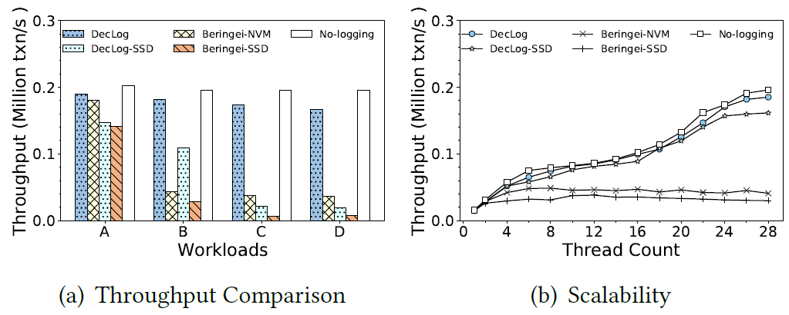
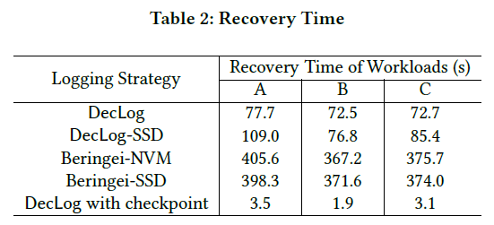

# DecLog
This is the source code of DecLog.

Our paper, "DecLog: Decentralized Logging in Non-Volatile Memory for Time Series Database Systems", is submitted to VLDB2024.

## Introduction

DecLog is decentralized logging system in NVM for TSDBMS by utilizing the characteristics of time series data to improve the logging performance. We implement it based on [a time series storage engine of Facebook, Beringei](https://pmem.io/pmdk/). The experimental study shows that the throughput of DecLog outperforms the Beringei TSDBMS by up to 4.6× with less recovery time in the YSCB-TS benchmark.

Compared with original Beringei, DecLog has following features:

* We propose a data-driven LSN based on the data accessed by transactions and track the transaction dependencies.
* We design a relaxed ordering strategy to persist log entries to NVM by using log flushing pipeline, which effectively addresses the transaction serialization issue caused by a heavy use of sfence instructions.
* We propose a thread snapshot based parallel logging method to further improve the concurrency of persisting logs to NVM in multi-threads with less thread synchronization overhead.
* We design a log compression and alignment algorithm to process the logs to decrease the log storage footprint and to fully utilize NVM properties.
* We implement checkpoint and recovery algorithms of DecLog to reduce the recovery time.

## Experiments

* **DecLog:** The compelete implementation of DecLog.
* **DecLog-SSD:** DecLog, but with logging in SSD.
* **Beringei-NVM:** The original implementation of Beringei with logging in NVM.
* **Beringei-SSD:** The original implementation of Beringei with logging in SSD.


<div align="center">
    
    
</div>

## Directory Description
* **YCSB-TS：** The source code for the benchmark, YCSB-TS developed with Java.
* **beringei：** The source code for DecLog, implemented based on Beringei with C++.
* **install：** Some scripts and packages, used to build the environment and DecLog.

## Build DecLog
[PMDK should be installed.](https://pmem.io/pmdk/)
[The ipmctl should be installed before building DecLog.](https://github.com/intel/ipmctl)
Copy Beringei to workspace.
```
$ unzip ./install/ALL.zip
$ sudo ./install/setup_ubuntu.sh
```
## Build YCSB-TS
YCSB-TS is a maven project and is compiled with JDK1.7.
To build it, run maven command `mvn clean package`.
Then uncompress the release package 
```
$ mv ./YCSB-TS/distribution/target/ycsb-0.4.0.tar.gz ./ycsb-0.4.0.tar.gz
$ tar -zxvf ./ycsb-0.4.0.tar.gz
```
## Before Run
[You should mount your PMEM* to a NVM-aware filesystem with DAX.](https://docs.pmem.io/persistent-memory/getting-started-guide/creating-development-environments/linux-environments/linux-memmap)
```
$ sudo mkfs.xfs /dev/pmem0
$ sudo mkdir /mnt/pmem0
$ sudo mount -o dax /dev/pmem0 /mnt/pmem0
$ sudo modprobe msr
```
Make directorys for data file, key list file, and log file in SSD
```
$ mkdir /tmp/gorilla_data
$ mkdir /tmp/key
$ mkdir /tmp/log
```

You can generate a beringei configuration file or modify hostAddress in the configuration file ./beringei/beringei.json.

```
sudo ./beringei/beringei/build/beringei/tools/beringei_configuration_generator --host_names $(hostname) --file_path $(filePath)

```


## Run DecLog

```
$ ./beringei/beringei/build/beringei/service/beringei_main \
        -beringei_configuration_path ./beringei/beringei.json \
        -create_directories \
        -bucket_size 600 \
        -buckets 120 \
        -logtostderr \
        -v=2 \
        -port 9997 \
        -shards 8 \
        -data_directory /tmp/gorilla_data \
        -key_directory /tmp/key/ \
        -log_directory /mnt/pmem \
        -log_writer_queue_size 300 \
        -log_writer_threads 4
```
## Run DecLog-SSD
```
$ ./beringei/beringei/build/beringei/service/beringei_main \
        -beringei_configuration_path ./beringei/beringei.json \
        -create_directories \
        -bucket_size 600 \
        -buckets 120 \
        -logtostderr \
        -v=2 \
        -port 9997 \
        -shards 8 \
        -data_directory /tmp/gorilla_data \
        -key_directory /tmp/key/ \
        -log_directory /tmp/log/ \
        -log_writer_queue_size 300 \
        -log_writer_threads 4
        -NVM_address_aligned 0 \
        -number_of_logging_queues 1 \
        -data_log_buffer_size 65536
```
## Run Beringei-NVM
```
$ ./beringei/beringei/build/beringei/service/beringei_main \
        -beringei_configuration_path ./beringei/beringei.json \
        -create_directories \
        -bucket_size 600 \
        -buckets 120 \
        -logtostderr \
        -v=2 \
        -port 9997 \
        -shards 8 \
        -data_directory /tmp/gorilla_data \
        -key_directory /tmp/key/ \
        -log_directory /mnt/pmem \
        -log_writer_queue_size 300 \
        -log_writer_threads 1
        -Beringei_NVM 1 \
        -NVM_address_aligned 0 \
        -number_of_logging_queues 1
```
## Run Beringei-SSD
```
$ ./beringei/beringei/build/beringei/service/beringei_main \
        -beringei_configuration_path ./beringei/beringei.json \
        -create_directories \
        -bucket_size 600 \
        -buckets 120 \
        -logtostderr \
        -v=2 \
        -port 9997 \
        -shards 8 \
        -data_directory /tmp/gorilla_data \
        -key_directory /tmp/key/ \
        -log_directory /tmp/log/ \
        -log_writer_queue_size 300 \
        -log_writer_threads 1
        -Beringei_NVM 1 \
        -NVM_address_aligned 0 \
        -number_of_logging_queues 1 \
        -data_log_buffer_size 65536
```


## Run the benchmark, YCSB-TS


```
$ ${jdk_dir}/bin/java \
        -classpath ./ycsb-0.4.0/lib/core-0.4.0.jar:./ycsb-0.4.0/beringei-binding/lib/beringei-binding-0.4.0.jar:./ycsb-0.4.0/beringei-binding/lib/slf4j-api-2.0.5.jar:./ycsb-0.4.0/beringei-binding/lib/slf4j-simple-2.0.5.jar:./ycsb-0.4.0/thrift/thriftjava-1.0-SNAPSHOT.jar com.yahoo.ycsb.Client \
        -db com.yahoo.ycsb.db.BeringeiDBClient -load -P ./ycsb-0.4.0/workloads/workloada -p host=$IP -p port=9997 -p shardCount=4 -s -threads 64 &> /dev/null
$ ${jdk_dir}/bin/java \
        -classpath ./ycsb-0.4.0/lib/core-0.4.0.jar:./ycsb-0.4.0/beringei-binding/lib/beringei-binding-0.4.0.jar:./ycsb-0.4.0/beringei-binding/lib/slf4j-api-2.0.5.jar:./ycsb-0.4.0/beringei-binding/lib/slf4j-simple-2.0.5.jar:./ycsb-0.4.0/thrift/thriftjava-1.0-SNAPSHOT.jar com.yahoo.ycsb.Client \
        -db com.yahoo.ycsb.db.BeringeiDBClient -P ./ycsb-0.4.0/workloads/workloada -p host=$IP -p port=9997 -p shardCount=4 -s -threads 64 > workloada_output.txt
```

